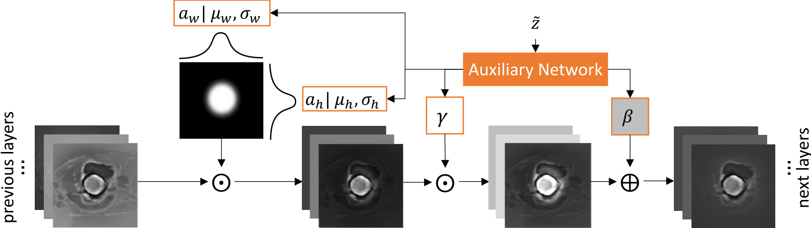

# INSIDE: INstance modulation with SpatIal DEpendency
Grzegorz Jacenków, Alison Q. O'Neil, Brian Mohr, Sotirios A. Tsaftaris

*Accepted to the International Conference on Medical Image Computing and
Computer-Assisted Intervention MICCAI 2020.*



## Abstract
We consider the problem of integrating non-imaging information into segmentation
networks to improve performance. Conditioning layers such as FiLM provide the
means to selectively amplify or suppress the contribution of different feature
maps in a linear fashion. However, spatial dependency is difficult to learn
within a convolutional paradigm. In this paper, we propose a mechanism to allow
for spatial localisation conditioned on non-imaging information, using a
feature-wise attention mechanism comprising a differentiable parametrised
function (e.g. Gaussian), prior to applying the feature-wise modulation. We name
our method INstance modulation with SpatIal DEpendency (INSIDE). The
conditioning information might comprise any factors that relate to spatial or
spatio-temporal information such as lesion location, size, and cardiac cycle
phase. Our method can be trained end-to-end and does not require additional
supervision. We evaluate the method on two datasets: a new CLEVR-Seg dataset
where we segment objects based on location, and the ACDC dataset conditioned on
cardiac phase and slice location within the volume.

## Installation
This code is ported to TensorFlow 2.0. We can also share code snippets
compatible with TensorFlow 1.x. Please, contact the first author via e-mail.

### Datasets
Download `CLEVR-Seg` dataset from our
[Google Drive](https://drive.google.com/file/d/1HfFoYwm8ltCitFo94JycbF5C3X3zx3Tu)
and unpack in `inside/datasets` folder.

The `ACDC` dataset can be downloaded from
[here](https://acdc.creatis.insa-lyon.fr/). Download `training.zip` file from
the website and unpack in `inside/datasets/acdc/raw` folder.

### Dependencies
You can install the dependencies with `pip install -r requirements.txt`.
Please note, we use [Comet.ml](https://www.comet.ml/) to track our experiments.

## Citation
```
@inproceedings{jacenkow2020inside,
  title={INSIDE: Steering Spatial Attention with Non-Imaging Information in CNNs},
  author={Jacenków, Grzegorz and O'Neil, Alison Q. and Mohr, Brian and Tsaftaris, Sotirios A},
  booktitle={International Conference on Medical Image Computing and Computer-Assisted Intervention},
  month = {October},
  year = {2020},
  organization={Springer}
}
```
